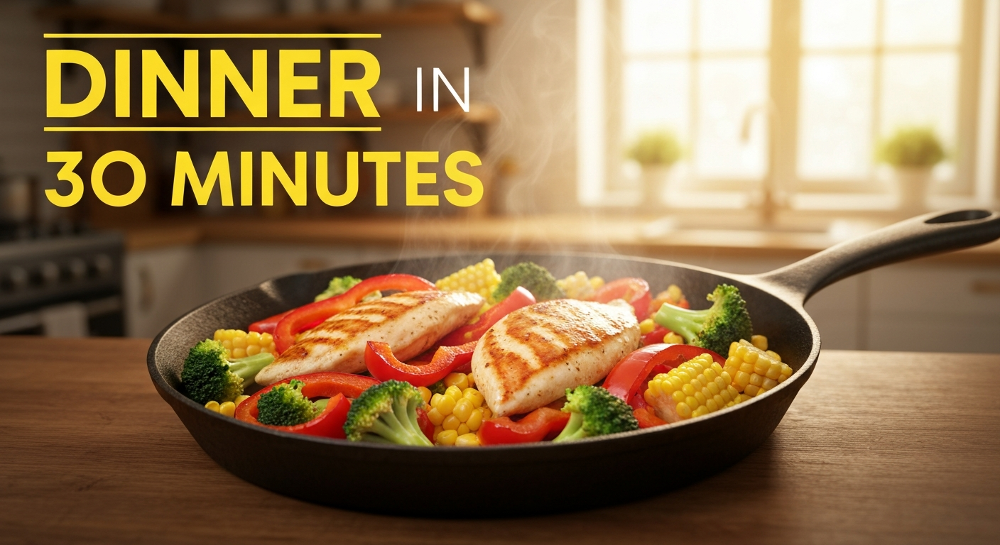
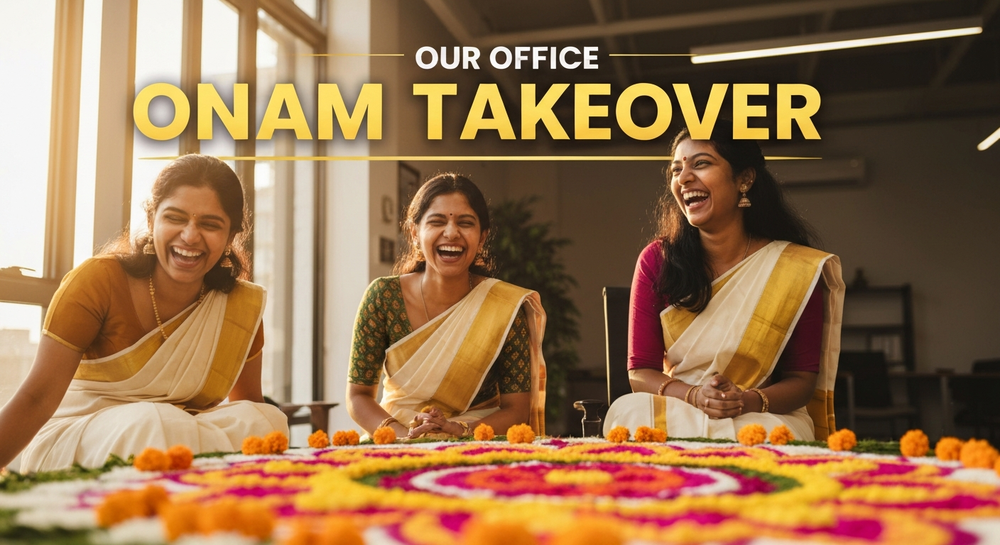

## Overview

This system generates YouTube thumbnails from a plain-text video topic. The user provides
a description of their video; the system returns a 16:9 PNG image with an overlaid title,
validated for relevance and quality.

The full pipeline is implemented as a LangGraph `StateGraph` with multiple nodes, conditional
edges for retry logic, and a quantitative + semantic validation layer.

---

## Architecture


---

## 1. Architecture Decisions

### 1.1 LangGraph StateGraph

The pipeline is built on LangGraph rather than a simple sequential function chain. The core
reason is the retry loop: when the validator rejects a thumbnail, the graph must feed
actionable feedback back to the first node (`analyze_topic`) and repeat the entire
generation cycle.

In a plain function chain this requires explicit loop state management. LangGraph encodes
the retry topology as a conditional edge — `route_after_validation` returns `"retry"` and
the graph re-enters `analyze_topic` — keeping routing logic separate from node logic and
making the flow easy to visualize and extend.

All graph state flows through a single `ThumbnailState` TypedDict. Every node receives the
full state, makes its changes, and returns an updated copy; there are no shared mutable
variables. This immutable-update pattern prevents subtle bugs where a retry overwrites
state from the previous attempt.

---

### 1.2 Gemini 2.5-Pro as the Reasoning Backbone

Every text-generation and vision step uses `gemini-2.5-pro` via `langchain-google-genai`.
Using a single model family for all reasoning steps has two practical advantages:

- **Single API key**: Gemini’s key covers both text-generation and vision validation calls.
  Imagen 4 uses the same key.
- **Consistent semantic space**: Topic analysis, prompt engineering, and validation all
  share the same model’s understanding of YouTube content, reducing semantic drift between
  pipeline stages.

---

### 1.3 Google Imagen 4.0-fast for Image Generation

`imagen-4.0-fast-generate-001` is used for image synthesis. Key decision factors:

- **Native 16:9 support** via `aspect_ratio="16:9"` — no post-processing crop required.
- **Direct bytes return** — raw PNG bytes are returned and stored directly in graph state.
- **Text rendering capability** — caption text is embedded directly into the image rather
  than overlaid via Pillow.

---

### 1.4 Two-Strategy Design: Enriched vs. Direct

The graph supports two generation strategies, selectable at runtime:

| Strategy | Extra LLM Call | How Text Is Injected |
|--------|---------------|---------------------|
| `enriched` (default) | Yes | Gemini plans font style, color, placement, glow, and contrast |
| `direct` | No | Fixed prompt template with inline text instructions |

The enriched strategy yields higher visual quality and adaptability. The direct strategy
is faster and more deterministic. `batch_test.py compare` enables A/B testing between both.

---

### 1.5 Validation-Driven Retry Loop

The validator performs:

1. **Quantitative checks** using Pillow / NumPy:
   - OCR accuracy
   - WCAG contrast ratio
   - Artifact score
   - Layout stability
2. **Semantic validation** using Gemini Vision

Failures produce structured feedback injected into the next retry.  
`MAX_RETRIES = 2` caps total attempts at three.

---

## 2. Failure Modes Encountered

### 2.1 Imagen Text Rendering Inconsistency

Text may be split, stylized incorrectly, or omitted. OCR F1 often drops below 0.50 for
decorative typography. Semantic vision validation catches many of these cases.

---

### 2.2 Imagen Safety-Filter Blocks (Non-Retryable)

Prompts involving real people or copyrighted characters may be blocked. These route
directly to the `abort` path and are not retried.

---

### 2.3 Topic Drift on Retry

Validator feedback can unintentionally alter the visual concept. This was mitigated by
making feedback narrowly scoped (e.g., adjust text size only).

---

### 2.4 Validator Hallucination / False Positives

Vision models may approve garbled text or reject valid images. Quantitative metrics act
as a quality floor even when semantic validation passes.

---

### 2.5 OCR Dependency Gap

`pytesseract` is optional and requires a system install (`tesseract-ocr`). When absent,
OCR score is treated as `0.0`, capping maximum quality. The metric output documents this
explicitly.

---

## 3. Trade-offs: Generation Quality vs. Correctness

### 3.1 AI Text Rendering vs. Pillow Overlay

**Chosen**: Imagen renders text natively for visual cohesion.  
**Alternative**: Pillow overlays guarantee OCR accuracy but look less integrated.

The retry loop compensates for text failures by requesting cleaner typography.

---

### 3.2 Retry Budget

Three total attempts (`MAX_RETRIES = 2`) balance quality, cost, and latency. Beyond this,
returns diminish sharply. Exhausted retries route to `mark_not_processable` without saving.

---

## 4. Running the Project

### 4.1 Environment Setup

```bash
cp env.example .env

```

### 4.2 Run the Pipeline

```bash
python main.py

```
### 4.3 Output

Generated thumbnails are saved in the thumbnails/ directory

Each run produces one 16:9 PNG image

Failed runs are documented but do not overwrite successful outputs

## 5. Summary

This project demonstrates how a LangGraph-based pipeline combining structured LLM
reasoning, native image synthesis, and layered validation can reliably generate YouTube
thumbnails with minimal human intervention.

Key architectural choices include graph-encoded retry logic, vision-based semantic
validation, pixel-level quality metrics, and strict separation of planning, generation,
and validation stages.


## 6. Outputs

Input: 30-minute dinner recipes anyone can make



Input: Onam celebration at office traditionaly

